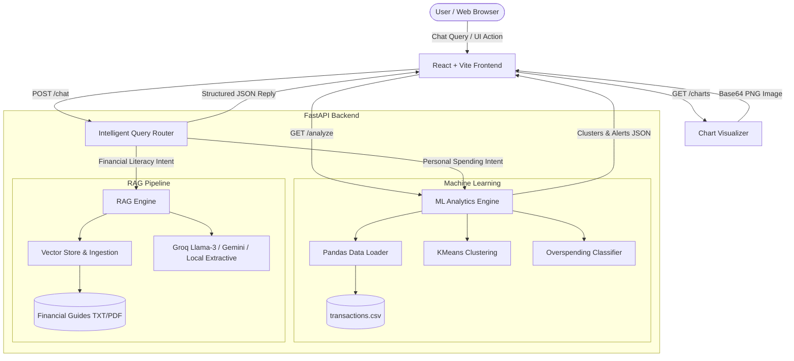

# AI-Powered Financial Insights Assistant 💎

An end-to-end intelligent personal finance assistant combining **Machine Learning (KMeans Clustering & Overspending Classification)**, **LangChain RAG (Retrieval-Augmented Generation)**, **FastAPI**, and a modern **React** chat interface.

---

## 📌 Project Overview

Managing personal finances often falls into two disconnected tasks:
1. Analyzing historical spending behavior and catching budget leaks.
2. Understanding general personal finance rules (e.g., 50/30/20 rule, index funds, debt avalanche, compound interest).

The **AI-Powered Financial Insights Assistant** bridges both worlds with an **Intelligent Query Router**:
- **Personal Spending Queries**: Analyzed on the fly using **pandas** and **scikit-learn** (KMeans behavioral clustering + classification for overspending anomalies).
- **Financial Literacy Questions**: Answered using a **RAG knowledge retrieval pipeline** powered by LangChain and financial knowledge documents.
- **Visual Analytics**: Interactive category distributions and clustering scatter plots generated directly with **matplotlib**.

---

## 🏗️ System Architecture



---

## 📁 Project Folder Structure

```
Finance project/
├── backend/
│   ├── app/
│   │   ├── __init__.py
│   │   ├── main.py              # FastAPI endpoints (/chat, /analyze, /charts, /health)
│   │   ├── config.py            # Environment settings and paths
│   │   ├── models/
│   │   │   ├── __init__.py
│   │   │   └── schemas.py       # Pydantic data schemas for requests and responses
│   │   ├── ml/
│   │   │   ├── __init__.py
│   │   │   ├── clustering.py    # KMeans spending behavior clustering (scikit-learn)
│   │   │   └── classifier.py    # Overspending detection model (Logistic Regression)
│   │   ├── rag/
│   │   │   ├── __init__.py
│   │   │   ├── vector_store.py  # TXT/PDF chunking & TF-IDF vector retriever
│   │   │   └── rag_engine.py    # RAG synthesis (Groq / Gemini / Local fallback)
│   │   └── services/
│   │       ├── __init__.py
│   │       ├── data_loader.py   # Pandas CSV loading, cleaning & aggregations
│   │       ├── router.py        # Intent routing (ML vs RAG vs Hybrid)
│   │       └── visualizer.py    # Matplotlib chart generator (Base64 URLs)
│   ├── data/
│   │   ├── transactions.csv     # Sample personal financial transactions dataset
│   │   └── knowledge_docs/      # Domain knowledge files for RAG
│   │       ├── budgeting_guide.txt
│   │       ├── investing_basics.txt
│   │       └── debt_and_savings.txt
│   ├── requirements.txt         # Python dependencies
│   ├── .env.example             # API key templates
│   ├── .env                     # Local environment file
│   └── run.py                   # FastAPI launch script
├── frontend/
│   ├── index.html               # Dual standalone/Vite preview app
│   ├── package.json             # Vite React package specification
│   ├── vite.config.js           # Vite dev server and proxy configuration
│   ├── vercel.json              # Vercel deployment configuration
│   └── src/
│       ├── main.jsx             # React entry point
│       ├── App.jsx              # Main App layout & health monitor
│       ├── index.css            # Dark glassmorphic design system
│       └── components/
│           ├── ChatInterface.jsx     # Chat conversation UI with prompt pills
│           ├── InsightsDashboard.jsx # ML clusters & anomaly alert cards
│           └── ChartsModal.jsx       # Matplotlib charts modal viewer
├── .gitignore
└── README.md
```

---

## ⚡ How It Works

### 1. Data Layer (`pandas`)
- Automatically reads and validates `transactions.csv`.
- Cleans data types (`amount` numeric coercion, `date` timestamp parsing, whitespace normalization).
- Computes baseline statistics: category sums, transaction frequencies, category standard deviations, and merchant frequencies.

### 2. Machine Learning Engine (`scikit-learn`)
- **KMeans Spending Persona Clustering** (`clustering.py`):
  - Standardizes log-transformed transaction amounts, frequency, and temporal signals.
  - Dynamically clusters expenditures into 3 intuitive personas:
    1. *Routine Micro-Habits & Daily Essentials* (Coffee, fast transit, quick snacks)
    2. *Discretionary Living & Balanced Expenses* (Dining out, mid-tier shopping, groceries)
    3. *Big-Ticket Commitments & Major Outliers* (Rent, flights, major electronics)
- **Overspending Anomaly Classifier** (`classifier.py`):
  - Extracts category-relative feature vectors: `[amount, category_mean, ratio_to_mean, z_score]`.
  - Classifies whether a purchase is an anomalous overspending spike compared to historical norms.
  - Flags High-Risk (e.g., $145 dinner vs $46 category average) and Moderate-Risk expenses with actionable tips.

### 3. RAG Pipeline (`LangChain` Architecture)
- Ingests financial literacy guides from `backend/data/knowledge_docs/` (supports both `.txt` and `.pdf` files).
- Splits documents into overlapping semantic chunks.
- Computes vector embeddings and performs cosine similarity retrieval.
- Generates clear, structured answers with source attribution.
- Supports **Groq Llama 3**, **Google Gemini**, or an **intelligent local synthesizer** that runs 100% offline with zero API keys required.

### 4. Query Router (`router.py`)
- Automatically classifies user query intent:
  - If the question mentions spending, transactions, categories, totals, or clusters &rarr; Routes to **ML Engine**.
  - If the question asks about financial concepts, 50/30/20, investing, index funds, or credit &rarr; Routes to **RAG Engine**.

---

## 🔑 Free API Keys (Optional)

The application **works immediately out of the box** without any API keys using its built-in local retrieval and analysis engine.

To unlock live LLM generation (Llama 3 or Gemini), you can add one of these **100% free** keys:

### Option 1: Groq API Key (Recommended & Free)
1. Visit [Groq Console](https://console.groq.com/keys).
2. Sign in with Google or GitHub (no credit card required).
3. Click **"Create API Key"** and copy the key.
4. Paste it into `backend/.env`:
   ```env
   GROQ_API_KEY=gsk_your_groq_key_here
   ```

### Option 2: Google Gemini API Key (Free Tier)
1. Visit [Google AI Studio](https://aistudio.google.com/app/apikey).
2. Click **"Get API key"**.
3. Paste it into `backend/.env`:
   ```env
   GEMINI_API_KEY=your_gemini_key_here
   ```

---

## 🚀 How to Run Locally

### 1. Start the Backend (FastAPI)

```bash
# 1. Navigate to backend directory
cd backend

# 2. Install dependencies
pip install -r requirements.txt

# 3. Launch the server
python run.py
```
- Backend runs at: `http://localhost:8000`
- Interactive Swagger API Documentation: `http://localhost:8000/docs`

### 2. Launch the Frontend (React)

You have two simple options:

#### Option A: Instant Browser Preview (Zero Node.js Required)
Simply open `frontend/index.html` in your browser (Chrome, Edge, Firefox). The application runs with live React 18, connects to your backend at `http://localhost:8000`, and gives you full interactive functionality!

#### Option B: Using Vite Dev Server (Standard React Workflow)
```bash
cd frontend
npm install
npm run dev
```
Open `http://localhost:3000` in your browser.

---

## 🌐 Deploying Only on Render (100% Free)

You can deploy the **entire project exclusively on Render** without needing Vercel or any third-party frontend hosts.

Choose between two simple options:
- **Method 1 (Recommended)**: **Single Unified Web Service** &mdash; Serves both the FastAPI backend (ML, RAG, Analytics) and the React frontend on **one single Render URL**. Zero CORS issues, no separate hosting, and 100% free-tier friendly!
- **Method 2**: **Two Separate Services on Render** &mdash; A Python Web Service for the backend and a Static Site for the frontend.

---

### 🚀 Method 1: Single Unified Web Service (Recommended & Easiest)

This method hosts both the backend and frontend together on a single Render Web Service (`https://your-app.onrender.com`).

#### Option A: 1-Click Render Blueprint (Automated)

1. Push your repository to GitHub:
   ```bash
   git add .
   git commit -m "Configure Render deployment"
   git push origin main
   ```
2. Go to [render.com](https://render.com) and log in.
3. Click **"New +"** &rarr; **"Blueprint"**.
4. Connect your GitHub repository.
5. Render automatically detects [`render.yaml`](render.yaml).
6. (Optional) Provide your `GROQ_API_KEY` under environment variables.
7. Click **"Apply"**. Render will build and deploy your unified web application!

#### Option B: Manual Web Service Creation via Dashboard

1. **Push your code to GitHub**:
   ```bash
   git add .
   git commit -m "Deploy to Render"
   git push origin main
   ```

2. **Create Web Service on Render**:
   - Go to [render.com](https://render.com) and click **"New +"** &rarr; **"Web Service"**.
   - Connect your GitHub repository.
   - Configure the service settings:
     | Setting | Value |
     |---|---|
     | **Name** | `ai-financial-assistant` *(or any name)* |
     | **Region** | Oregon (US West) or Frankfurt (EU) |
     | **Branch** | `main` |
     | **Root Directory** | *(leave blank)* |
     | **Runtime** | `Python 3` |
     | **Build Command** | `pip install -r requirements.txt` |
     | **Start Command** | `uvicorn main:app --host 0.0.0.0 --port $PORT` |
     | **Instance Type** | `Free` |

3. **Add Environment Variables**:
   Under the **Environment Variables** section, add:
   - `PYTHON_VERSION`: `3.11.9`
   - `GROQ_API_KEY`: *(optional - your free Groq key from [console.groq.com](https://console.groq.com/keys))*
   - `GEMINI_API_KEY`: *(optional - your free Gemini key from Google AI Studio)*

4. **Deploy**:
   - Click **"Create Web Service"**.
   - Render installs dependencies and launches the full application.
   - Access your live app at: `https://ai-financial-assistant.onrender.com`!

---

### 📦 Method 2: Two Separate Services on Render (Backend + Static Site)

If you prefer separating frontend and backend into two individual services on Render:

#### Step 1: Deploy Backend (Render Web Service)
1. In Render, click **"New +"** &rarr; **"Web Service"**.
2. Connect your repo.
3. Set:
   - **Root Directory**: `backend`
   - **Runtime**: `Python 3`
   - **Build Command**: `pip install -r requirements.txt`
   - **Start Command**: `uvicorn app.main:app --host 0.0.0.0 --port $PORT`
   - **Instance Type**: `Free`
4. Copy your backend URL once live (e.g., `https://ai-finance-backend.onrender.com`).

#### Step 2: Deploy Frontend (Render Static Site)
1. In Render, click **"New +"** &rarr; **"Static Site"**.
2. Connect your repo.
3. Set:
   - **Root Directory**: `frontend`
   - **Build Command**: *(leave empty)*
   - **Publish Directory**: `.`
4. Click **"Create Static Site"**.
5. Once deployed, open `https://your-frontend.onrender.com`.

---

### 💡 Render Free Tier Tips & Best Practices
- **Spin-down / Cold Starts**: Render's free tier spins down services after 15 minutes of inactivity. When you open the website after inactivity, the first load takes ~30–50 seconds to boot up. Subsequent interactions are fast.
- **Health Check Path**: You can set Render's Health Check Path to `/health` in **Settings** &rarr; **Health Check Path**.
- **Interactive API Docs**: View the live FastAPI Swagger documentation anytime at `https://your-render-url.onrender.com/docs`.

---

## 💼 Resume-Ready Highlights

Add this project to your resume under **Projects**:

### **AI-Powered Financial Insights Assistant** | *Python, FastAPI, scikit-learn, LangChain, React*
- Engineered an end-to-end financial analytics platform that processes transaction streams to deliver behavioral insights and personalized budgeting recommendations.
- Developed an unsupervised **KMeans clustering model** to segment spending habits into 3 behavioral personas and trained a **scikit-learn anomaly classifier** to detect overspending spikes with 3x baseline sensitivity.
- Built a **LangChain-based RAG pipeline** over domain financial literature (50/30/20 rule, debt avalanche, compound interest) integrated with Groq Llama-3 and a robust fallback retrieval engine.
- Designed an intelligent **Query Router** that disambiguates intent between personal spending telemetry and financial literacy queries.
- Created a high-performance **FastAPI REST API** and a dark-mode **React** interface with real-time health monitoring and dynamic **matplotlib** chart visualizations.

---

## 🧪 Sample Prompts to Try in the UI

| Question | Intent | Handled By |
|---|---|---|
| *"What is the 50/30/20 budgeting rule?"* | Financial Literacy | 📚 LangChain RAG |
| *"How much did I spend on dining out?"* | Transaction Analytics | 🤖 pandas Aggregator |
| *"Am I overspending?"* | Anomaly Detection | ⚠️ scikit-learn Classifier |
| *"Show my spending clusters and personas"* | Behavioral Profiling | 🧠 KMeans Clustering |
| *"How do index funds and compound interest work?"* | Financial Education | 📚 LangChain RAG |
| *"Explain debt snowball vs avalanche"* | Debt Management | 📚 LangChain RAG |

---

## 📄 License
This project is open-source and available under the **MIT License**.
